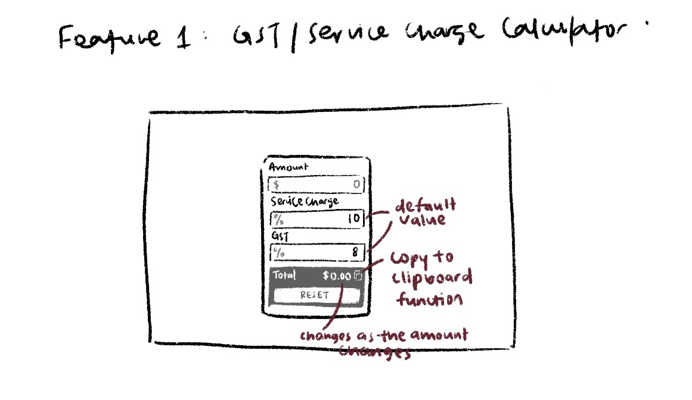
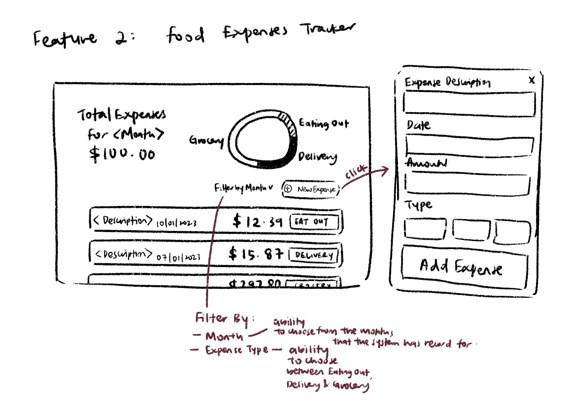
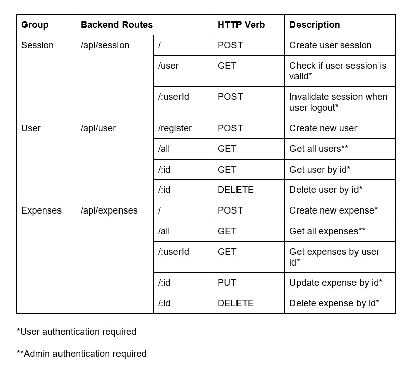
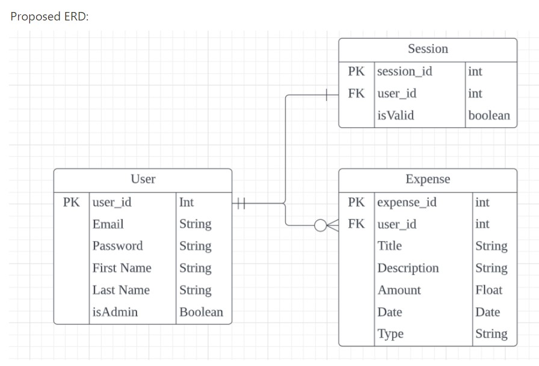

# ChowBread

This is a fullstack web application created for General Assembly’s Software Engineering Immersive Program. This is the frontend repository of the application. The backend repository can be found [here](https://github.com/charmainelhm/chowbread-backend).

ChowBread is a web application built for users to track their food expenses. After registering for an account, users can then add food expenses in ChowBread to a clearer visualisation on how much and where the money was spent on. There is also an in-built GST calculator which users can use to find out their share of bill when dining out with friends.

### Technical Used

These are the cool friends that helped made my application possible

Frontend:

- [React](https://reactjs.org/)
- [React Router](https://reactrouter.com/en/main)
- [Tailwind CSS](https://tailwindcss.com/)
- [Redux Toolkit](https://redux-toolkit.js.org/)
- [Axios](https://axios-http.com/)
- [React Spinners](https://www.npmjs.com/package/react-spinners)
- [react-chartjs-2](https://react-chartjs-2.js.org/)
- [Chart.js](https://www.chartjs.org/)

Backend:

- [Node.js](https://nodejs.org/en/)
- [TypeScript](https://www.typescriptlang.org/)
- [Express](https://expressjs.com/)
- [Prisma](https://www.prisma.io/)
- [JWT Token](https://jwt.io/)

Database:

- [PostgreSQL](https://www.postgresql.org/)

### Installation Instructions

All the necessary libraries needed for the web application to run are found in the package.json file provided. Install them using <code>npm install</code> if you are using node package manager.

If you wish to run the backend server with your own database, you will need to link your database to the server for it to run properly.

## Development Process

### User Stories

Firstly, the important features of the web application were determined having these user stories in mind:

    User Story 1: As someone who goes out with my friends often I need a way to figure out a way to calculate my portion when splitting bills.
    User Story 2: As someone who is concerns about food budgetting I need a way to track how much I spend for food and analyse how I can improve on my food budget.

From there, these are some of the main features that ChowBread should have:

- A calculator that provides a quick and easy way for users to find out the total amount that includes GST and service charge
- A feature that allows users to add new entry for food expenses
- A chart that provides a visualisation on a user's spending habits

### Wireframes

Simple wireframes were then developed to accommodate to all the features the application should have:

### Server Routes

A backend server was created to help with authenticating users and retrieve all the data necessary to be displayed on the frontend. With the main features in mind, below are routes we came up with for the server:

### Data Structure

A relational database was created to store important data such as user data and expense data for the application, and how the different pieces of information are related can be found in the entity relationship diagram below:

### Future Development

- Add a function that allows user to filter for expenses that they require, such as filtering for a particular month or filtering just expenses spent on eating out.
